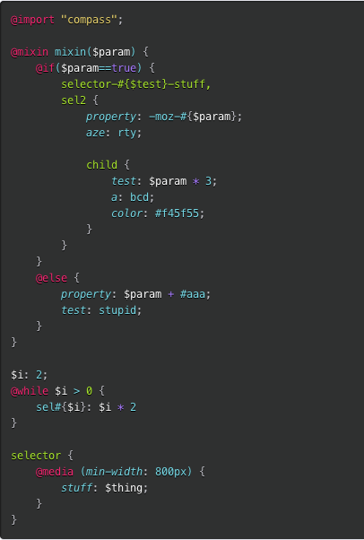

# Sass Prism base theme

A [prism.js](http://prismjs.com/) theme base in [Sass](http://sass-lang.com). Including an example inspired by [Monokai](http://www.monokai.nl/blog/2006/07/15/textmate-color-theme/).

## Usage

Just open the `_prism.scss` to see what variable are available.
Define yours, then include the prism partial.

```scss
$code-background:          #2a2a2a;
$code-color:               #76d9e6;
$code-color-fade:          #bebec5;
$code-text-shadow:         0 1px 0 #000;

$code-color-comment:        #6f705e;
$code-color-keyword:        #f12770;
$code-color-value:          #76d9e6;
$code-color-string:         #e6d06c;
$code-color-name:           #e6d06c;
$code-color-number:         #a77afe;
$code-color-variable:       #fff;
$code-color-selector:       #a6e22d;

@import "prism";
```

## Example

Inspired by [Monokai](http://www.monokai.nl/blog/2006/07/15/textmate-color-theme/)



To get this example, just grab the `tests/s.scss` file.

## License

Copyright (c) 2013 Maxime Thirouin

Released under [MIT Licence](http://moox.mit-license.org/)

